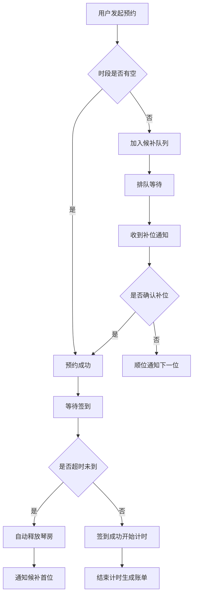

# 共享琴房管理系统 产品需求文档

## 1. 产品概述

本系统是面向连锁琴行的共享琴房管理Web平台，解决琴房资源调度、候补补位自动化、时段差异化计费等核心痛点。通过智能化的排期与计费系统，提升琴房利用率，优化用户练琴体验，降低运营成本。

- 目标用户：琴行运营管理人员、练琴用户
- 核心价值：自动化资源调度、多档位智能计费、候补补位无缝衔接

## 2. 核心功能

### 2.1 用户角色

| 角色 | 登录方式 | 核心权限 |
|------|----------|----------|
| 管理员 | 账号密码登录 | 琴房管理、费率配置、数据统计、账单查看 |
| 前台/操作员 | 账号密码登录 | 预约登记、候补管理、签到签退、账单查询 |

### 2.2 功能模块

1. **琴房排期模块**：琴房资源建档、日程排期视图、预约登记、超时自动释放
2. **候补补位模块**：候补排队登记、补位通知推送、自动顺位补位
3. **时段计费模块**：时段费率表维护、高峰平峰多档费率、跨档时长拆分计算
4. **账单生成模块**：练琴时长统计、账单自动生成、账单查询导出

### 2.3 页面详情

| 页面名称 | 模块名称 | 功能描述 |
|-----------|-------------|---------------------|
| 总览仪表盘 | 数据概览 | 今日琴房使用率、营收统计、在练人数、待处理候补 |
| 琴房排期 | 日程排期 | 周视图/日视图排期表、拖拽预约、状态展示 |
| 琴房管理 | 资源建档 | 琴房列表、新增/编辑琴房、设备配置、状态管理 |
| 候补队列 | 候补补位 | 候补列表、排队顺位、补位通知记录、手动补位 |
| 费率设置 | 时段计费 | 费率档位管理、时段划分、节假日特殊费率 |
| 账单管理 | 账单生成 | 账单列表、明细查看、统计报表、导出功能 |
| 签到签退 | 前台操作 | 快速签到、结束计时、实时费用计算 |

## 3. 核心流程

### 3.1 预约与候补流程

用户选择琴房和时段进行预约，若该时段已满则加入候补队列。预约成功后，用户需在规定时间内签到，超时未到系统自动释放琴房，并通知候补队列中的首位用户补位。

### 3.2 跨档计费流程

系统根据预约时段自动拆分跨越费率切换点的时长，按各档位费率分段计算费用后合计总金额。

## 4. 用户界面设计

### 4.1 设计风格

- **主色调**：深胡桃木色（#5D4037）搭配暖金色（#FFB300），营造音乐艺术氛围
- **辅助色**：墨绿（#2E7D32）表示可用、深红（#C62828）表示占用、橙色（#EF6C00）表示候补
- **整体风格**：优雅精致，现代简约中融入古典音乐元素，卡片式布局搭配微妙阴影
- **字体**：标题使用 Playfair Display 衬线体体现艺术感，正文使用 Noto Sans SC 保证可读性
- **按钮风格**：圆角矩形，悬停有微缩放和阴影加深效果
- **图标风格**：线性图标，统一使用 Lucide 图标库

### 4.2 页面设计概述

| 页面名称 | 模块名称 | UI元素 |
|-----------|-------------|-------------|
| 总览仪表盘 | 数据概览 | 统计卡片、使用率环形图、今日预约时间轴、候补提醒 |
| 琴房排期 | 日程排期 | 时间轴网格、琴房列、彩色状态块、拖拽交互、悬停详情 |
| 琴房管理 | 资源建档 | 卡片列表、琴房照片、设备标签、状态开关 |
| 候补队列 | 候补补位 | 排队序号卡片、用户信息、等待时长、通知状态徽章 |
| 费率设置 | 时段计费 | 时间轴可视化、费率档位色块、拖拽调整时段边界 |
| 账单管理 | 账单生成 | 表格列表、搜索筛选、统计图表、导出按钮 |

### 4.3 响应式设计

- 桌面端优先设计，适配 1280px 及以上宽度
- 平板端（768px-1024px）：侧边栏折叠、排期表简化
- 移动端（<768px）：垂直堆叠布局、底部导航、简化操作

### 4.4 交互动效

- 页面切换：淡入 + 轻微上移动画
- 排期块：悬停放大、阴影加深
- 状态变化：颜色渐变过渡动画
- 通知提示：从右侧滑入，带轻微弹跳效果
- 数据加载：骨架屏脉冲动画
