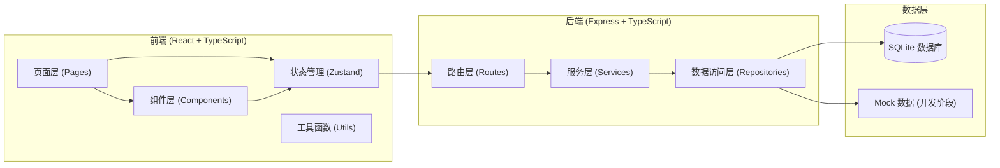
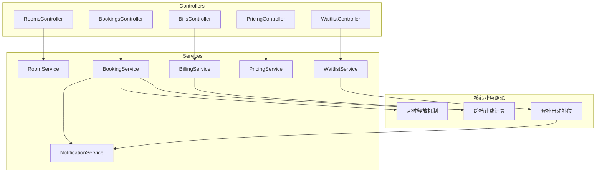
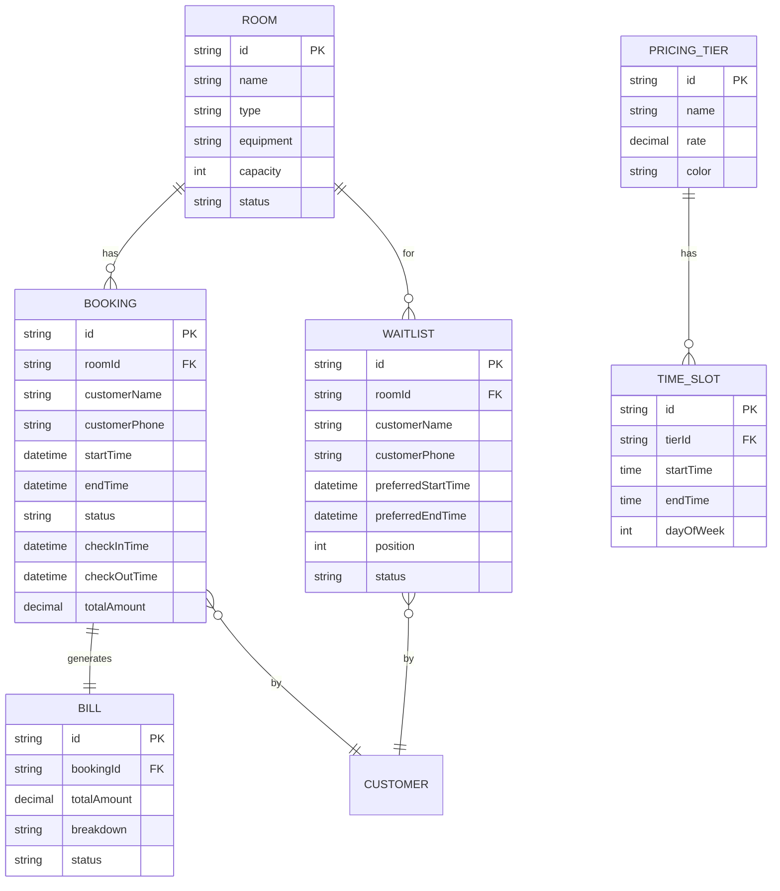

# 共享琴房管理系统 技术架构文档

## 1. 架构设计



## 2. 技术描述

- **前端框架**：React@18 + TypeScript
- **构建工具**：Vite
- **状态管理**：Zustand
- **UI 样式**：Tailwind CSS v3
- **路由**：React Router DOM
- **图标库**：Lucide React
- **后端框架**：Express@4 + TypeScript
- **数据库**：SQLite（开发初期使用内存数据 + JSON 持久化）
- **初始化工具**：vite-init（react-express-ts 模板）

## 3. 路由定义

| 路由路径 | 页面名称 | 模块 |
|----------|----------|------|
| /dashboard | 总览仪表盘 | 数据概览 |
| /schedule | 琴房排期 | 日程排期 |
| /rooms | 琴房管理 | 资源建档 |
| /waitlist | 候补队列 | 候补补位 |
| /pricing | 费率设置 | 时段计费 |
| /bills | 账单管理 | 账单生成 |
| /checkin | 签到签退 | 前台操作 |

## 4. API 定义

### 4.1 琴房相关接口

```typescript
// 琴房数据模型
interface Room {
  id: string;
  name: string;
  type: 'standard' | 'premium' | 'grand';
  equipment: string[];
  capacity: number;
  status: 'available' | 'maintenance' | 'disabled';
  description?: string;
  createdAt: string;
}

// 获取琴房列表
GET /api/rooms
Response: { rooms: Room[] }

// 创建琴房
POST /api/rooms
Request: { name: string; type: string; equipment: string[]; capacity: number }
Response: { room: Room }

// 更新琴房
PUT /api/rooms/:id
Request: Partial<Room>
Response: { room: Room }

// 删除琴房
DELETE /api/rooms/:id
Response: { success: boolean }
```

### 4.2 预约相关接口

```typescript
// 预约数据模型
interface Booking {
  id: string;
  roomId: string;
  customerName: string;
  customerPhone: string;
  startTime: string;
  endTime: string;
  status: 'booked' | 'checked_in' | 'completed' | 'cancelled' | 'no_show';
  checkInTime?: string;
  checkOutTime?: string;
  totalAmount: number;
  createdAt: string;
}

// 获取指定日期的预约
GET /api/bookings?date=2024-01-01
Response: { bookings: Booking[] }

// 创建预约
POST /api/bookings
Request: { roomId: string; customerName: string; customerPhone: string; startTime: string; endTime: string }
Response: { booking: Booking }

// 签到
POST /api/bookings/:id/checkin
Response: { booking: Booking }

// 签退
POST /api/bookings/:id/checkout
Response: { booking: Booking; bill: Bill }

// 取消预约
DELETE /api/bookings/:id
Response: { success: boolean }
```

### 4.3 候补相关接口

```typescript
// 候补数据模型
interface WaitlistEntry {
  id: string;
  roomId?: string; // 可选，不指定则为所有琴房候补
  customerName: string;
  customerPhone: string;
  preferredStartTime: string;
  preferredEndTime: string;
  position: number;
  status: 'waiting' | 'notified' | 'confirmed' | 'cancelled';
  notifiedAt?: string;
  createdAt: string;
}

// 获取候补队列
GET /api/waitlist?date=2024-01-01
Response: { entries: WaitlistEntry[] }

// 加入候补
POST /api/waitlist
Request: { customerName: string; customerPhone: string; preferredStartTime: string; preferredEndTime: string; roomId?: string }
Response: { entry: WaitlistEntry }

// 通知候补
POST /api/waitlist/:id/notify
Response: { entry: WaitlistEntry }

// 确认补位
POST /api/waitlist/:id/confirm
Response: { booking: Booking }

// 取消候补
DELETE /api/waitlist/:id
Response: { success: boolean }
```

### 4.4 费率相关接口

```typescript
// 费率数据模型
interface PricingTier {
  id: string;
  name: string; // 高峰、平峰、夜间等
  rate: number; // 每小时价格
  color: string; // 显示颜色
}

interface TimeSlot {
  id: string;
  tierId: string;
  startTime: string; // HH:mm 格式
  endTime: string;   // HH:mm 格式
  dayOfWeek: number; // 0-6，0为周日
}

// 获取费率档位
GET /api/pricing/tiers
Response: { tiers: PricingTier[] }

// 获取时段配置
GET /api/pricing/slots
Response: { slots: TimeSlot[] }

// 计算费用
POST /api/pricing/calculate
Request: { startTime: string; endTime: string; roomType?: string }
Response: { totalAmount: number; breakdown: { tier: string; duration: number; amount: number }[] }
```

### 4.5 账单相关接口

```typescript
// 账单数据模型
interface Bill {
  id: string;
  bookingId: string;
  customerName: string;
  roomName: string;
  startTime: string;
  endTime: string;
  actualDuration: number; // 分钟
  totalAmount: number;
  breakdown: { tier: string; duration: number; amount: number }[];
  status: 'unpaid' | 'paid' | 'refunded';
  paidAt?: string;
  createdAt: string;
}

// 获取账单列表
GET /api/bills?page=1&pageSize=20&startDate=&endDate=
Response: { bills: Bill[]; total: number; page: number; pageSize: number }

// 获取账单详情
GET /api/bills/:id
Response: { bill: Bill }

// 统计数据
GET /api/bills/stats?period=day|week|month
Response: { totalRevenue: number; totalHours: number; billCount: number }
```

## 5. 服务层架构



## 6. 数据模型

### 6.1 ER 图



### 6.2 核心数据存储

系统使用内存数据结构 + JSON 文件持久化的方式存储数据，便于开发和演示。数据文件存储在 `api/data/` 目录下：

- `rooms.json` - 琴房数据
- `bookings.json` - 预约记录
- `waitlist.json` - 候补队列
- `pricing.json` - 费率配置
- `bills.json` - 账单数据

## 7. 核心算法

### 7.1 跨档计费算法

```typescript
function calculatePricing(startTime: Date, endTime: Date, timeSlots: TimeSlot[]): {
  totalAmount: number;
  breakdown: { tier: string; duration: number; amount: number }[];
} {
  // 1. 将时间范围按天拆分
  // 2. 对每一天，按时段档位拆分时长
  // 3. 各时段费用 = 该时段内分钟数 / 60 × 对应费率
  // 4. 汇总所有时段费用
}
```

### 7.2 超时自动释放机制

- 系统定时任务（每 30 秒）检查所有已预约状态的订单
- 如果预约开始时间已过且未签到，超过 gracePeriod（默认 15 分钟）则标记为 no_show
- 释放琴房资源后，自动检查候补队列并通知首位候补用户

### 7.3 候补补位逻辑

- 候补按加入时间排序，FIFO 原则
- 琴房释放后，按候补顺序依次通知
- 每位候补用户有 5 分钟确认时间，超时自动顺位下一位
- 支持指定琴房候补和通用候补两种模式
